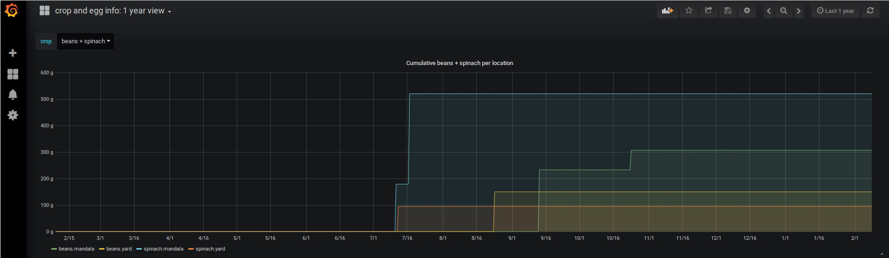

### Automatic Graphing of Google Document Data

There was some talk of data entry from the harvests last year. Everyone likes good old fashioned pen-and-paper (easy, and accessible) but data entry is becoming old-fashioned, too. The way of the world now is to automate everything you possibly can (from your lighting, to your garage door, to scheduling meetings, to pizza delivery) so I figured I'd take a hack at this. In the end, in order to "fully" automate it, we'll need some additional hardware. 

In the interim, a Google document will have to satisfy.

**Requirements**
* docker
* a public Google spreadsheet (anyone with a link can view)
* some data you want to graph!

Firstly, get docker set up and running. Follow the instructions here. You can install `collectd` or not, it doesn't matter. collectd is interesting and useful, though, and this is a good way to get everything set up initially and introduce you to some docker concepts if you're not familiar with how containers work, especially when you want to have containers that interact with one another.

https://blog.laputa.io/try-influxdb-and-grafana-by-docker-6b4d50c6a446

Okay, great. Now we have a bunch of services up and running, neat UIs and yada yada. 

If you want to use influxdb, great. Check out the docs. I'd never used it before today but it seems logical enough once you understand how ingesting data and the schemas work. You have a spreadsheet, right? You're likely working with (mostly) numbers. influxdb has an advantage over other databases I've used with grafana before, like graphite, because not every label:value pair is required to be a number. influxdb has something called tags. Let's take a look at a regular string we'd send to influxdb. In this case, data retrieved by a Google Form and therefore sent into a Google Sheet.

**Timestamp,Crop,Date harvested,Weight (grams),Number of pieces,Location,Notes**  
2018/02/02 15:41:52,test,2018/10/23,150,4,Mandala,  
2018/02/08 15:49:09,eggs,2018/02/08,,1,Chickens,%

Oh boy oh boy. We have headers, spaces, empty fields, and EOF characters! Everything we love to parse. Being an ex-sysadmin, I'll just whack something easy together in bash. Let's look at the fields here first.

**Form timestamp:** If you've gotten data that's been submitted through a Google Form, the timestamp that form was submitted will show up here. I'd imagine some people care about this date, and some don't. We don't. We care about when a crop was harvested, which is a different field. So my script is going to simply...ignore this field.  
**Name of $THING:** The first field is probably the most important. In this case, it's our crop. Everything we want to do with our dataset is going to be divided by crop, right? We can always do math and everything else over the entire database if we wish, and combine all crop data, but I imagine we'll want to be able to break down data by crop. Okay, this is going to be our **measurement**. This is what influxdb calls them. It's the main label for a thing. Things can have other strings related to them, but we'll revisit that in a sec.  
**Another date!:** This is our harvest date. This is also the date we want to enter as the timestamp into influxdb, or whatever time-series database we're using. They speak Unix timestamps. Influxdb likes nanoseconds, so we'll give it what it wants. I'm gonna go ahead and convert that into ns.  
**IMPORTANT!** use a date format that computers like AND one you can read. You don't have to enter unix timestamps into your spreadsheet, but make sure it's a common one so GNU `date` can at least make sense of it. This usually means use fullyear/month/day H:M:S.   
**MISSING FIELD!!!!:** Here's our weight. Sometimes we don't weigh things. Sometimes we don't get all the data we want. You should never count on getting all the data you want, because then you'll be disappointed and things will break. So, since we can't used "null" or "undefined" or anything like that here, since most time-series databases don't approve of that, we'll use a sane default: 0. Later, from grafana, we can exclude zero-values easily if we want to evaluate our data in such a way to only include those crops that we have weights for. This way we'll prevent data loss from forgotten or incomplete fields.   
**Count:** Another value, a number of things. Keep in mind we need to name these values; pick names that are meaningful to you and anyone else who may see your data.   
**A string field!:** This is the name of the place where we've harvested our crop. It's an identifier that's obvious to everyone who is going to be viewing the data. I mean, to be fair, chickens are basically a garden for eggs. Since this is a **string**, and not a **numerical value**, we're going to have to handle this differently. We're going to store this in something called a **tag**.  

What is influxdb expecting? A string, of course, but where we put the spaces is very important. Anything in the <>'s is optional.

`my_measurement,<any_tag=any_string>,<as_many=as_you_want> only_numbers_now=30,<these_are_field_keys=100.51> 1518116988465208044`

That's a lot of nanoseconds.
The database this goes into is defined by the URL you give your client (curl or whatever else you're using). Here's how I do it:

`curl -i -XPOST 'http://localhost:8086/write?db=collectd' --data-binary $your_formatted_data`

Here, collectd is the name of my database. I named it that when I set it up (according to that guide earlier). You can explore that data using the influxdb webclient and check out whatever.

On to Grafana. Make a dashboard, play around with it. Get a feel for what it does. There's good documentation on what all the functions of influxdb do (there's a lot more mathematical functions for graphite, but they can get slow). 

Templating is probably the most important thing here. In order to get a dropdown with a number of different things you can select to fine-grain your data, create a new variable in the dashboard settings (gear on the top right-ish of the page) when you're in a dashboard view). In order to make the crops selectable, I created a variable called "crop", label "crop", type Query (as you're getting a list populated from the results of a database query), from the influxdb datasource, and QUERY: **SHOW MEASUREMENTS**. I like to sort alphabetically and being able to select multiple values to compare. There are more advanced features, but this is the important bit.

The most useful thing you can do is play around with your data and display options to create interesting, well-designed dashboards. Data collection is addicting, but it needs to be useful. Make sure the values you're seeing are sane. The only thing more useless than not having data is having _bad_ data. 
